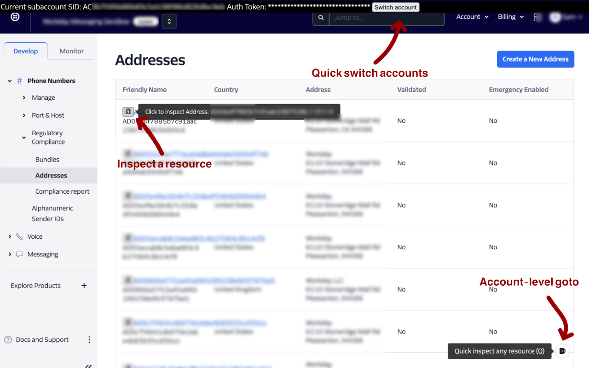
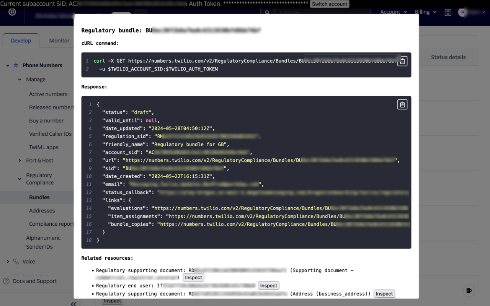

# Twilio Console Plus

Add some secret saurce to Twilio console

<p align="center">
  <a href="https://chromewebstore.google.com/detail/twilio-console-plus/jnfdlgjcofdjielkhbffdlblijbecome" target="_blank">
    
  </a>

  <a href="https://addons.mozilla.org/en-US/firefox/addon/twilio-console-plus/" target="_blank">
    
  </a>
</p>

Designed to enhance your Twilio console experience,
Twilio Console Plus allows you to seamlessly switch between your Twilio
subaccounts with ease, saving time and improving workflow efficiency.
Additionally, Twilio Console Plus allows you to view detailed information
of selected Twilio resources in JSON format, complete with sample cURL
commands for quick API testing and integration.

## Screenshots





## Build

```sh
npm run build  # Generate the dist/bundle.js
```

### Package a zip

```sh
npm run package
```
