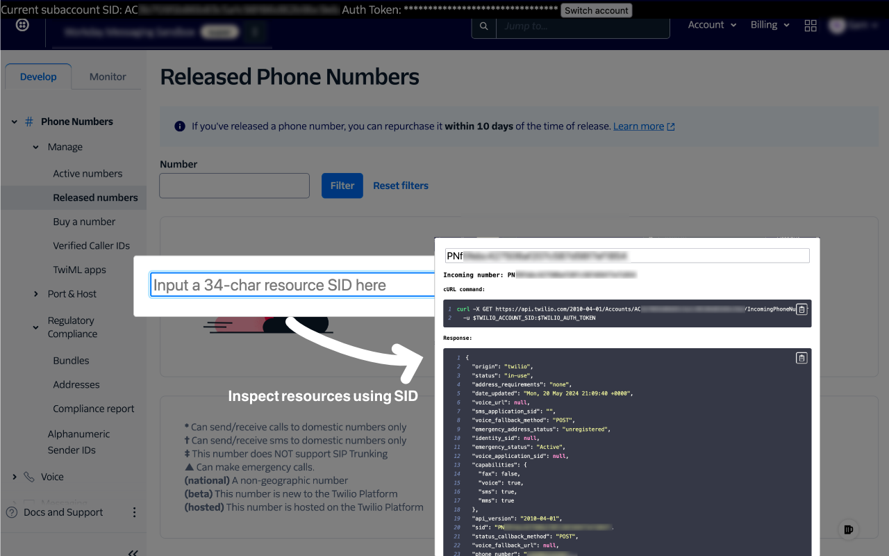

# Twilio Console Plus

Add some secret saurce to Twilio console

<p align="center">
  <a href="https://chromewebstore.google.com/detail/twilio-console-plus/jnfdlgjcofdjielkhbffdlblijbecome" target="_blank">
    
  </a>

  <a href="https://addons.mozilla.org/en-US/firefox/addon/twilio-console-plus/" target="_blank">
    
  </a>
</p>

Designed to elevate your Twilio console experience, Twilio Console Plus offers the following features:

- For each supported resource, an inspect button is added to its hyperlink, enabling you to view the resource object in JSON format and the sample cURL command for swift API testing and integration. Related resources will also be accessible for inspection.
- The current subaccount information is displayed at the top, accompanied by a quick switch button to transition to another subaccount easily.
- An account-level "Go To" search box can be activated by pressing "Q" or the floating button at the bottom right corner. It can discern the type of resource from the SID.

## Screenshots




## Additional configuration on Firefox

Firefox by default doesn't grant `host_permission` for manifest V3 extensions
[until the upcoming version 127](https://hg.mozilla.org/mozilla-central/rev/a069d7806c9b),
so in order to enable Twilio Console Plus, head to "Manage Your Extensions" -> "Twilio Console Plus" -> "Permissions" and toggle on the optional permission.


## Build

```sh
npm run build  # Generate the dist/bundle.js
```

### Install on Chrome after the build

1. **Open Chrome and Navigate to Extensions Page**

   - Open the Google Chrome browser.
   - Click on the three vertical dots in the upper-right corner of the browser to open the menu.
   - Navigate to `More tools` > `Extensions`.

2. **Enable Developer Mode**

   - On the Extensions page, you will see a toggle switch for `Developer mode` in the upper-right corner.
   - Turn on `Developer mode` by clicking the toggle switch.

3. **Load Unpacked Extension**
   - Click on the `Load unpacked` button that appears after enabling Developer mode.
   - A file dialog will open. Navigate to the extension directory `twilio-console-plus`.
   - Select the folder that contains the extension files and click `Select Folder`.

### Install on Firefox after the build

1. **Open Firefox and Navigate to Add-ons Manager**

   - Open the Mozilla Firefox browser.
   - Click on the three horizontal lines in the upper-right corner of the browser to open the menu.
   - Select `Add-ons and themes` from the menu.

2. **Enable Debugging Mode**

   - In the Add-ons Manager, click on the gear icon (⚙️) in the upper-right corner and choose `Debug Add-ons`.
   - This will open the `about:debugging` page.

3. **Enable Add-on Debugging**

   - On the `about:debugging` page, click on the `This Firefox` tab on the left sidebar.
   - Enable the `Enable add-on debugging` checkbox.

4. **Load Temporary Add-on**
   - Click on the `Load Temporary Add-on...` button.
   - A file dialog will open. Navigate to the extension directory `twilio-console-plus`.
   - Select the `manifest.json` file in the directory.

### Package a zip

```sh
npm run package
```
